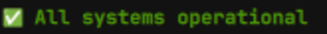
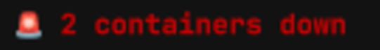
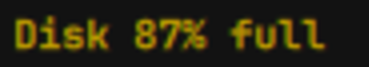
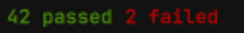
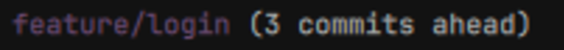
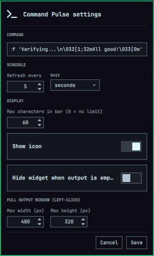

# Command Pulse

An [Omarchy](https://omarchy.org/) shell bar widget that runs a shell
command on a schedule and shows its live output right in the status bar —
including ANSI colors, so a command that colors its own output (`git status
--short`, a healthcheck script, `ls --color`, a custom CLI, …) looks the
same in the bar as it does in your terminal.

## Features

- Runs **any shell command** (`bash -lc "<command>"`), on your schedule.
- Interval configurable in **seconds, minutes, or hours**.
- Shows the **last non-blank line** of the output on the bar face — the
  line that actually matters for a multi-line command (a script that logs
  its progress and then prints a final status, say).
- Renders **ANSI SGR colors and styles** (16-color, 256-color, and truecolor
  foreground, plus bold, dim, italic, underline, strikethrough, inverse) as
  real color in the bar — not just plain text.
- **Left-click** opens the full output (every line, still ANSI-colored) in a
  popup capped at a configurable max width/height, with scrolling for
  anything bigger.
- **Right-click** opens a settings form right on the bar — command,
  interval, bar/popup sizing, all editable without touching `shell.json`.
- **Middle-click** reruns the command immediately.
- Hover for a quick tooltip with the command and current status.

## Screenshots

### Bar face

Six different commands, six different looks — it's all just ANSI escape
codes in each command's own output:

<br>`ping -c 1 -W 1 8.8.8.8 >/dev/null 2>&1 && printf '\033[32m✅ All systems operational\033[0m\n' \|| printf '\033[31mNetwork failed\033[0m\n'` 

<br>`printf '\033[33m%s containers down\033[0m\n' "$(docker ps -a --filter 'status=exited' --filter 'status=dead' -q \| wc -l)"`

<br>`printf '\033[33mDisk %s full\033[0m\n' "$(df / --output=pcent \| tail -1 \| tr -d ' ')"`

<br>`printf '\033[32m42 passed\033[0m \033[31m2 failed\033[0m'`

<br>`printf '\033[35mfeature/login\033[0m \033[2m(3 commits ahead)\033[0m'`

### Settings (right-click)



Right-click the widget any time to change the command, interval, or sizing
— no need to touch `shell.json` by hand.

## Install

```sh
omarchy plugin add https://github.com/Giuliano-sn/omarchy-command-pulse
```

Or clone manually into `~/.config/omarchy/plugins/` and enable it:

```sh
git clone https://github.com/Giuliano-sn/omarchy-command-pulse \
  ~/.config/omarchy/plugins/io.github.giuliano-sn.command-pulse
omarchy plugin enable io.github.giuliano-sn.command-pulse --section right
```

## Configuration

**Right-click the widget** to open its settings form directly on the bar —
command, refresh interval (with a seconds/minutes/hours unit), max bar-label
length, icon/hide toggles, and the full-output popup's max width/height.
Hit Save and it writes straight back to `~/.config/omarchy/shell.json`.

You can also edit its entry under `bar.layout.<section>` in
`~/.config/omarchy/shell.json` directly:

```json
{
  "id": "io.github.giuliano-sn.command-pulse",
  "command": "git status --short | tail -1",
  "intervalValue": 30,
  "intervalUnit": "seconds",
  "maxLength": 60,
  "showIcon": true,
  "hideWhenEmpty": false,
  "maxPopupWidth": 480,
  "maxPopupHeight": 320
}
```

| Key              | Type                                 | Default     | Description                                                                 |
| ---------------- | ------------------------------------ | ----------- | --------------------------------------------------------------------------- |
| `command`        | string                               | `uptime -p` | Shell command to run via `bash -lc`.                                        |
| `intervalValue`  | integer                              | `30`        | How often to run it.                                                        |
| `intervalUnit`   | enum (`seconds`, `minutes`, `hours`) | `seconds`   | Unit for `intervalValue`.                                                   |
| `maxLength`      | integer                              | `60`        | Truncate the bar label past this many visible characters (`0` = no limit).  |
| `showIcon`       | boolean                              | `true`      | Show a terminal glyph before the output.                                    |
| `hideWhenEmpty`  | boolean                              | `false`     | Hide the widget entirely when the command's output is empty.                |
| `maxPopupWidth`  | integer                              | `480`       | Max width (px) of the left-click full-output popup.                         |
| `maxPopupHeight` | integer                              | `320`       | Max height (px) of the left-click full-output popup; taller output scrolls. |

The bar face shows the **last non-blank line** of the command's output,
capped at `maxLength` characters. Left-click for the full, multi-line,
ANSI-colored output (defensively capped at 500 lines / 20000 characters for
a runaway command), sized up to `maxPopupWidth` × `maxPopupHeight` with
scrolling beyond that.

If the command's stdout is empty but it printed something to stderr, that is
shown instead (and the bar face turns the bar's "urgent" color when the
command exits non-zero).

## Why "ANSI colors, respected"

The widget parses SGR (`ESC[...m`) escape codes out of the command's output
and converts them into the small subset of rich text QML's `Text.StyledText`
actually understands (`<font color="...">`, `<b>`, `<i>`, `<u>`, `<s>`) — so
a `\x1b[32mOK\x1b[0m` in your script's output really does show up green in
the bar, at the exact color the terminal would have used. Background colors
are approximated by swapping the foreground when a command uses "inverse"
video, since the bar's lightweight text renderer has no fill/highlight tag
to paint an actual background with.

## License

MIT — see [LICENSE](LICENSE).
